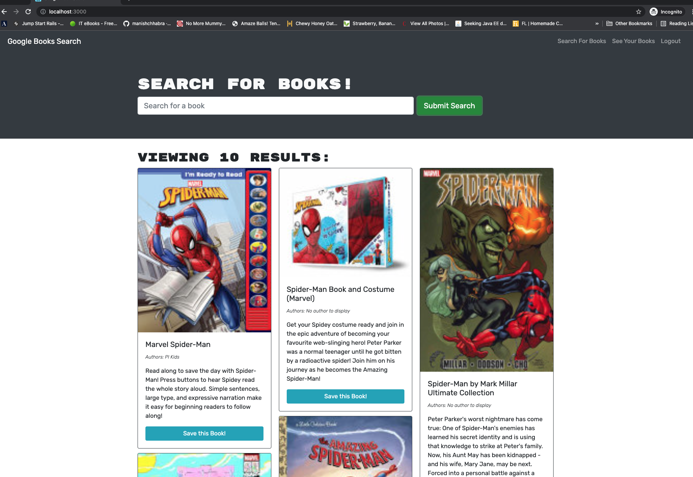

# Book Search Engine

## Project Description

This project refactors a Google Books API search engine from a RESTful API to a GraphQL API with Apollo Server. The search engine is built using the MERN stack - MongoDB, Express.js, React, and Node.js. A user can create an account, search for books, and save them to a list. On a separately rendered page, the user can see their saved books and remove books from the list.

## Tools Used

- Create React App
- React
- Node.js
- Express.js
- MongoDB and Mongoose
- JSON Web Tokenk
- JavaScript ES5 and ES6
- HTML and CSS
- Heroku

## Deployed Application

The application is deployed on Heroku at https://mp-book-search.herokuapp.com/

## Screenshot

